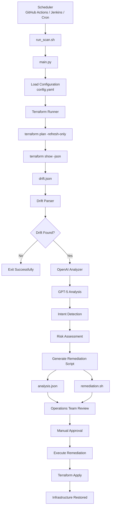

**Architecture Diagram**

# Terraform AI Drift Detector - End-to-End Architecture

```mermaid
flowchart TD

    A["Scheduler<br/>GitHub Actions / Jenkins / Cron"] --> B["run_scan.sh"]

    B --> C["main.py"]

    C --> D["Load Configuration<br/>config.yaml"]

    D --> E["Terraform Runner"]

    E --> F["terraform plan -refresh-only"]

    F --> G["terraform show -json"]

    G --> H["drift.json"]

    H --> I["Drift Parser"]

    I --> J{"Drift Found?"}

    J -->|No| K["Exit Successfully"]

    J -->|Yes| L["OpenAI Analyzer"]

    L --> M["GPT-5 Analysis"]

    M --> N["Intent Detection"]

    N --> O["Risk Assessment"]

    O --> P["Generate Remediation Script"]

    P --> Q["analysis.json"]

    P --> R["remediation.sh"]

    Q --> S["Operations Team Review"]

    R --> S

    S --> T["Manual Approval"]

    T --> U["Execute Remediation"]

    U --> V["Terraform Apply"]

    V --> W["Infrastructure Restored"]
```

