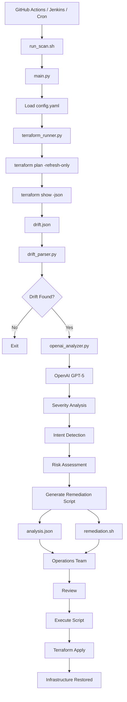

**Architecture Diagram**

## Architecture Diagram

```mermaid
flowchart TD

    A[GitHub Actions / Jenkins / Cron] --> B[run_scan.sh]
    B --> C[main.py]

    C --> D[Load config.yaml]

    D --> E[terraform_runner.py]

    E --> F[terraform plan -refresh-only]
    F --> G[terraform show -json]

    G --> H[drift.json]

    H --> I[drift_parser.py]

    I --> J{Drift Found?}

    J -->|No| K[Exit]

    J -->|Yes| L[openai_analyzer.py]

    L --> M[OpenAI GPT-5]

    M --> N[Severity Analysis]
    N --> O[Intent Detection]
    O --> P[Risk Assessment]
    P --> Q[Generate Remediation Script]

    Q --> R[analysis.json]
    Q --> S[remediation.sh]

    R --> T[Operations Team]
    S --> T

    T --> U[Review]
    U --> V[Execute Script]

    V --> W[Terraform Apply]
    W --> X[Infrastructure Restored]
```
